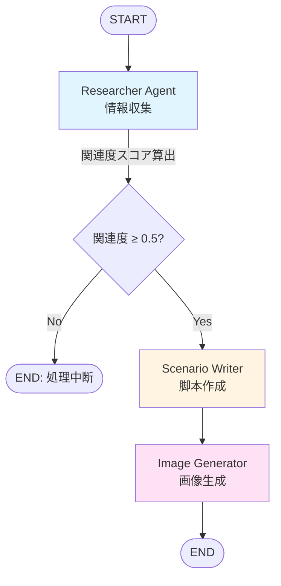

# Manganize

ドキュメントファイルやウェブコンテンツの内容を「まんがタイムきらら」風 4 コマ漫画に変換する LangGraph エージェント。

## セットアップ

```bash
git clone https://github.com/atsu/manganize.git
cd manganize
uv sync
uv run playwright install chromium

# API キー取得: https://aistudio.google.com/app/apikey
export GOOGLE_API_KEY="your-api-key-here"
```

## 使い方

```bash
# URL / テキスト / ドキュメントから漫画を生成
uv run python main.py "https://example.com/article"
uv run python main.py "Transformerアーキテクチャについて"
uv run python main.py "/path/to/document.pdf"
```

出力: `output/YYYYMMDD_HHMMSS/` に research_results.txt、scenario.txt、generated_image.png

## アーキテクチャ

3つのエージェントによる LangGraph パイプライン：



### エージェント詳細

| エージェント | 役割 | 使用モデル | ツール |
|------------|------|-----------|--------|
| **Researcher** | 情報収集 & ファクトシート作成 | gemini-2.5-pro | DuckDuckGo 検索、Web ページ取得（Playwright）、ドキュメント読取（MarkItDown） |
| **Scenario Writer** | 4コマ漫画脚本作成 | gemini-2.5-flash | なし |
| **Image Generator** | 漫画画像生成 | gemini-3-pro-image-preview | Google Search（9:16、2K、リトライ3回） |


## プロジェクト構成

```
manganize/
├── manganize/
│   ├── agents.py       # LangGraph エージェント定義
│   ├── tools.py        # Web取得・画像生成ツール
│   └── prompts.py      # システムプロンプト
├── assets/             # キャラクター参照画像
├── docs/
│   ├── specs/          # 機能仕様（EARS記法）
│   └── wiki/           # 技術ドキュメント（Divio分類）
├── main.py             # CLI エントリーポイント
└── AGENTS.md           # エージェント向けガイド
```

## Web アプリケーション

```bash
# 開発サーバー起動（Hot Reload 有効）
task dev
# または
uv run fastapi dev web/main.py --reload-dir web --reload-dir manganize

# ブラウザで http://127.0.0.1:8000 にアクセス
```

## 開発

```bash
task lint       # Ruff リント
task format     # Ruff フォーマット
task typecheck  # ty 型チェック
task dev        # Web 開発サーバー起動
```

詳細: [AGENTS.md](AGENTS.md)


## ドキュメント

- [docs/specs/](docs/specs/) - 機能仕様（EARS記法）
- [docs/wiki/](docs/wiki/) - 技術ドキュメント（Tutorials / How-to / Reference / Explanation）

## ライセンス

MIT License
